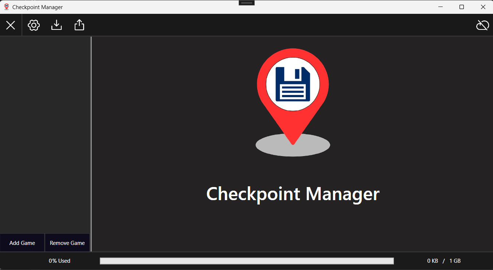

#  Checkpoint Manager

Checkpoint Manager é um software Windows de gerenciamento de arquivos de save de jogos, podendo realizar rotinas automatizadas de backup para os saves dos jogos armazenados localmente no computador e a realização de armazenamento de vários arquivos de save diferentes para facilitar o retorno à um momento específico do jogo.
> Apesar de não ser o objetivo do projeto, este programa pode ser utilizado para realizar backups de outros tipos de arquivos, como documentos de texto (caso queira utilizar para este propósito, é recomendado testar o programa antes de utilizar por completo).

 

### Ajustes e melhorias

O projeto ainda está em desenvolvimento e as próximas atualizações serão voltadas para as seguintes tarefas:

- [ ] Integração ao Google Drive do usuário via API
- [ ] Melhoria de janelas de diálogos

## 💻 Pré-requisitos

Antes de começar, verifique se você atendeu aos seguintes requisitos:

- .NET 8.0+ (Para execução das releases do projeto) ou .NET SDK 8.0+ (Para contribuição e modificação do projeto)
- Você tem uma máquina que possua sistema operacional Windows 10 ou 11.

## ☕ Usando Checkpoint Manager

Para utilizar o Checkpoint Manager, siga estas etapas:

1. Verifique se sua máquina possui os requisitos minimos para rodar o programa
2. Baixe a release mais recente do projeto.
3. Descompacte a pasta do programa
4. Execute o arquivo "Checkpoint-Manager.exe"
5. Aproveite os benefícios do programa!

> O programa cria arquivos de configuração na Roaming do usuário que o está executando. Por isso, se for executado em mais de um usuário Windows ou utilizar o mesmo arquivo de release baixado em outro computador, as configurações e listagem de jogos serão geradas novamente.
> O programa contém sistemas de Exportação e Importação dos saves na sua janela principal, para caso queira transferir ou compartilhar seus saves para outro usuário e/ou máquina.

## 🛠️ Ferramentas utilizadas no projeto

- C#
- .NET 8.0
- WPF (Windows Presentation Foundation) - Para a UI
- Visual Studio 2022

### ➕ Pacotes/Bibliotecas adicionais utilizados

Este projeto utiliza os seguintes pacotes NuGet:
- [CommunityToolkit.Mvvm](https://www.nuget.org/packages/CommunityToolkit.Mvvm)
- [TAlex.WPF.Controls](https://www.nuget.org/packages/TAlex.WPF.Controls)

## 😄 Contribuição

Sugestões para o projeto através de novas Issues e pull requests são muito bem vindas! 

### 📫 Contribuindo com o Checkpoint Manager

Para contribuir com o Checkpoint Manager, siga estas etapas:

> Preferêncialmente utilize como IDE o Visual Studio 2022

1. Bifurque este repositório.
2. Instale no projeto os pacotes NuGet listados anteriormente.
3. Crie um branch: `git checkout -b <nome_branch>`.
4. Faça suas alterações e confirme-as: `git commit -m '<mensagem_commit>'`
5. Envie para o branch original: `git push origin <nome_do_projeto> / <local>`
6. Crie a solicitação de pull.

Como alternativa, consulte a documentação do GitHub em [como criar uma solicitação pull](https://help.github.com/en/github/collaborating-with-issues-and-pull-requests/creating-a-pull-request).

## 📝 Licença

Esse projeto está sob licença MIT. Veja o arquivo [LICENÇA](LICENSE.md) para mais detalhes.
